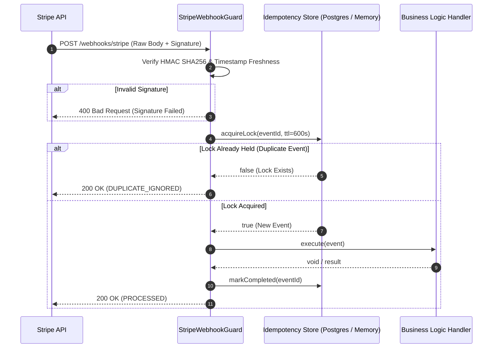

# 🛡️ Stripe Webhook Guard

> **Production-grade, zero-loss Stripe webhook idempotency, cryptographic verification, and duplicate-suppression toolkit for Node.js & TypeScript.**

[](LICENSE)
[](https://www.typescriptlang.org/)
[]()

---

## 💥 The Problem
Stripe webhook delivery guarantees are **"at-least-once."** During network timeouts, deploy spikes, or serverless cold starts:
1. Stripe automatically retries failed/delayed webhooks.
2. Concurrent retries cause **race conditions** and duplicate order fulfillment / double-charging.
3. Serverless edge functions timing out after 10s cause Stripe to mark endpoints as broken.

**Stripe Webhook Guard** solves this with strict database-level idempotency locking, cryptographic HMAC SHA256 verification, and sub-50ms acknowledgment patterns.

---

## 🏗️ Architecture



---

## 🚀 60-Second Quickstart

### 1. Installation
```bash
npm install stripe-webhook-guard
```

### 2. Express Integration
```typescript
import express from 'express';
import { StripeWebhookGuard } from 'stripe-webhook-guard';

const app = express();
const guard = new StripeWebhookGuard({
  webhookSecret: process.env.STRIPE_WEBHOOK_SECRET
});

// Register handler for checkout sessions
guard.on('checkout.session.completed', async (event) => {
  const session = event.data.object;
  console.log(`💰 Paid: ${session.id} for $${session.amount_total / 100}`);
  // Safe database provisioning here (zero duplicate risk!)
});

// Express webhook endpoint (must use raw body)
app.post(
  '/api/webhooks/stripe',
  express.raw({ type: 'application/json' }),
  async (req, res) => {
    const result = await guard.processEvent(
      req.body,
      req.headers['stripe-signature'] as string
    );

    if (!result.success && result.status === 'SIGNATURE_FAILED') {
      return res.status(400).send(result.message);
    }

    return res.status(200).json(result);
  }
);

app.listen(3000, () => console.log('Webhook server running on :3000'));
```

---

## 🧪 Running Tests

```bash
npx ts-node tests/guard.test.ts
```

---

## 💼 Enterprise Support & Custom Payment Integrations

Need custom payment architecture, multi-currency Stripe Connect routing, or zero-downtime database webhook reconciliation?

* **$250 Fast-Fix Stripe Webhook Audit:** 3-hour diagnostic & production repair for failing webhook endpoints.
* **$500 Complete Payment Pipeline Sprint:** Turnkey Express/Fastify/Next.js Stripe integration with PostgreSQL idempotency tables and dead-letter queue retries.
* **Inquiries:** Contact Jayson Quindao (Lead Systems Architect & Founder) at **[jquindao1@icloud.com](mailto:jquindao1@icloud.com?subject=Stripe%20Webhook%20Integration%20Sprint)** or visit **[GG Loop Platform](https://djjrip.github.io/gaming-for-groceries/)**.

---

## 📄 License
MIT License. Built by the **[GG Loop](https://djjrip.github.io/gaming-for-groceries/)** engineering team.
