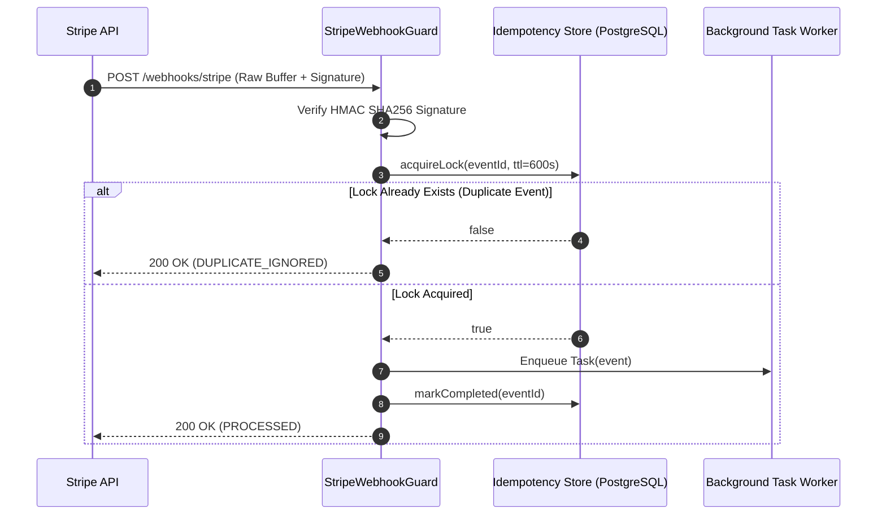

# How Stripe Webhooks Actually Fail in Production (And How to Build Zero-Loss Idempotency)
**Author:** Jayson Quindao (Lead Systems Architect & Founder, GG Loop LLC)  
**Target Publication:** Dev.to / Hashnode / Medium / Hacker News

---

## The Illusion of Webhook Simplicity
Most developers implement Stripe webhooks by adding a simple POST endpoint:
```typescript
app.post('/webhook', express.json(), (req, res) => {
  const event = req.body;
  if (event.type === 'checkout.session.completed') {
    fulfillOrder(event.data.object);
  }
  res.json({ received: true });
});
```

In development, this works 100% of the time. In production, it eventually causes **duplicate order fulfillment, double credit provisioning, or silent payment drop-offs**.

---

## The 3 Silent Failure Modes in Production

### 1. "At-Least-Once" Delivery & Replay Storms
Stripe guarantees **at-least-once delivery**, not exactly-once. If your server takes more than 10–15 seconds to process a webhook (e.g. during a database lock spike or cold start), Stripe's edge closes the socket, assumes failure, and schedules automatic exponential retries.
* **The Disaster:** If your handler executed 80% of the order fulfillment before the timeout, Stripe's retry will execute it a second time, charging or provisioning twice.

### 2. The Raw Body vs. JSON Parser Trap
To verify Stripe signatures (`stripe.webhooks.constructEvent`), you must verify the cryptographic HMAC SHA256 against the **exact raw byte buffer** received over the wire.
* If middleware like `express.json()` or `body-parser` normalizes whitespace or keys before signature calculation, cryptographic validation fails, dropping valid paid events.

### 3. Serverless Edge Timeouts
On AWS Lambda or Vercel edge functions, long-running business logic (sending emails, updating CRM, generating invoices) inside the webhook handler causes the function to time out.
* **The Rule:** A webhook endpoint must acknowledge Stripe with a `200 OK` in **<50ms**, offloading heavy work asynchronously.

---

## The Architecture of a Zero-Loss Webhook Guard



---

## The Open-Source Solution: `stripe-webhook-guard`
We open-sourced [`stripe-webhook-guard`](https://github.com/djjrip/stripe-webhook-guard), a lightweight, zero-dependency TypeScript toolkit that provides:
1. **Timing-safe HMAC SHA256 signature verification**.
2. **Pluggable database idempotency locking** (PostgreSQL / Redis / Memory).
3. **Automatic duplicate replay suppression** returning immediate `200 OK (DUPLICATE_IGNORED)`.

### Quick Installation:
```bash
npm install stripe-webhook-guard
```

```typescript
import { StripeWebhookGuard } from 'stripe-webhook-guard';

const guard = new StripeWebhookGuard({
  webhookSecret: process.env.STRIPE_WEBHOOK_SECRET
});

guard.on('checkout.session.completed', async (event) => {
  console.log(`Processing verified payment: ${event.data.object.id}`);
});
```

---

## 💼 Need Enterprise Payment Resilience?
If you're building a high-volume fintech backend or experiencing payment webhook drop-offs, the **[GG Loop Engineering Team](https://djjrip.github.io/gaming-for-groceries/)** offers 48-hour payment pipeline hardening sprints.

Contact: **[jquindao1@icloud.com](mailto:jquindao1@icloud.com?subject=Stripe%20Webhook%20Integration%20Sprint)**
